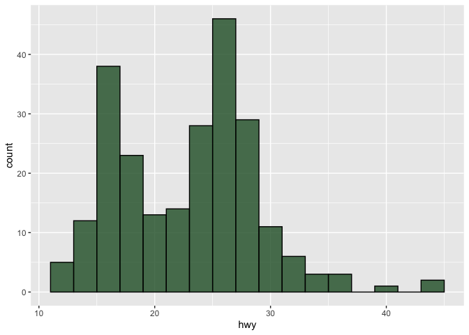
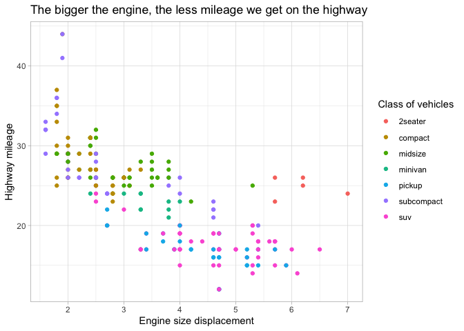
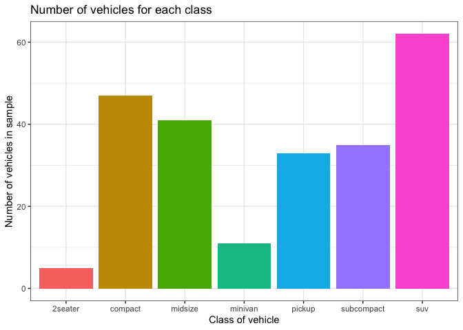
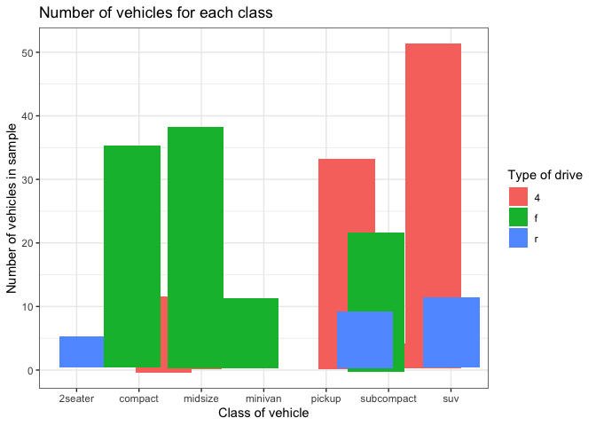
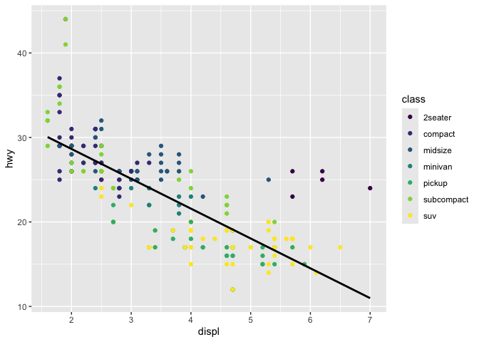

# Visualize Data
Sequoia Fellenbaum

<!-- If you get the error "Error in list2(na.rm = na.rm, ...) : object 'ffi_list2' not found" do the following in the Console run:  
&#10;    remove.packages("rlang")
&#10;Then Restart R to be safe. Then run:
&#10;    install.packages("rlang")
&#10;and again restart R to be safe. That should fix the problem (which is a package dependency issue).   -->

Try your code again

## Your Turn 0

Add a setup chunk that loads the tidyverse packages.

``` r
head(mpg)
```

    # A tibble: 6 × 11
      manufacturer model displ  year   cyl trans      drv     cty   hwy fl    class 
      <chr>        <chr> <dbl> <int> <int> <chr>      <chr> <int> <int> <chr> <chr> 
    1 audi         a4      1.8  1999     4 auto(l5)   f        18    29 p     compa…
    2 audi         a4      1.8  1999     4 manual(m5) f        21    29 p     compa…
    3 audi         a4      2    2008     4 manual(m6) f        20    31 p     compa…
    4 audi         a4      2    2008     4 auto(av)   f        21    30 p     compa…
    5 audi         a4      2.8  1999     6 auto(l5)   f        16    26 p     compa…
    6 audi         a4      2.8  1999     6 manual(m5) f        18    26 p     compa…

## Your Turn 1

Run the code on the slide to make a graph. Pay strict attention to
spelling, capitalization, and parentheses!

``` r
ggplot(data = mpg) + 
  geom_point(mapping = aes(x=displ, 
                           y=hwy))
```


``` r
#initializing plot and laying geometry on top
```

## Your Turn 2

Replace this scatterplot with one that draws boxplots. Use the
cheatsheet. Try your best guess.

``` r
ggplot(data = mpg) +
  geom_boxplot(mapping = aes(x = class, y = hwy))
```


## Your Turn 3

Make a histogram of the `hwy` variable from `mpg`. Hint: do not supply a
y variable.

``` r
ggplot(mpg) +
  geom_histogram(aes(x = hwy))
```

    `stat_bin()` using `bins = 30`. Pick better value `binwidth`.


## Your Turn 4

Use the help page for `geom_histogram` to make the bins 2 units wide.

``` r
ggplot(mpg) +
  geom_histogram(aes(x = hwy),
                 binwidth = 2,
                 alpha = 0.8, #transparency in color
                 fill = "#245c2f", #fill color
                 color = "black" #outline color
                 )
```



## Your Turn 5

Add `color`, `size`, `alpha`, and `shape` aesthetics to your graph.
Experiment.

``` r
ggplot(data = mpg) +
  geom_point(mapping = aes(x = displ, 
                           y = hwy,
                           color = class)) + 
#color was the best option
  labs(x = "Engine size displacement", #x axis title
       y = "Highway mileage", # y axis title
       color = "Class of vehicles", #class color title
       title = "The bigger the engine, the less mileage we get on the highway ") + #graph title
  theme_light() #overall theme
```



## Help Me

What do `facet_grid()` and `facet_wrap()` do? (run the code, interpret,
convince your group)

``` r
# Makes a plot that the commands below will modify
q <- ggplot(mpg) + geom_point(aes(x = displ, y = hwy)) #assign base plot to a name for easy iteration testing

q + facet_grid(. ~ cyl) #four columns of graphs - one row, i think organized by cyl
```


``` r
q + facet_grid(drv ~ .) #three rows of graphs - one column, i think organized by drv
```


``` r
q + facet_grid(drv ~ cyl) #twelve graphs - 3 rows by drv 4 by cyl, i think organized by drv horizontally and cyl vertically
```


``` r
q + facet_wrap(~ class) #seven graphs organized by vehicle class
```


## Your Turn 6

Make a bar chart `class` colored by `class`. Use the help page for
`geom_bar` to choose a “color” aesthetic for class.

``` r
ggplot(mpg) +
  geom_bar(aes(x=class,
               fill = class)) + #double-mapping class to two aesthetics
  guides(fill = "none") + #hides legend
  labs(x = "Class of vehicle",
       y = "Number of vehicles in sample",
       title = "Number of vehicles for each class"
  ) +
  theme_bw()
```



``` r
ggplot(mpg) +
  geom_bar(aes(x=class,
               fill = drv), 
           position = position_jitter()) + 
  
  labs(x = "Class of vehicle",
       y = "Number of vehicles in sample",
       title = "Number of vehicles for each class",
       fill = "Type of drive"
  ) +
  theme_bw()
```



## Quiz

What will this code do?

Two geometries to one plot

``` r
ggplot(mpg) + 
  geom_point(aes(displ, hwy)) +
  geom_smooth(aes(displ, hwy)) 
```

    `geom_smooth()` using method = 'loess' and formula = 'y ~ x'


``` r
#ggsave("example.jpg", width = 6, height = 4) #saves most recently rendered plot, will overwrite if changed, commented out to prevent saving every time rendered
```

``` r
ggplot(mpg, aes(x=displ, y = hwy)) + 
  geom_point(aes(color = class)) +
  geom_smooth(color = "black",
              se = FALSE, #hides prediction line
              method = "lm") + #linear regression model
  scale_color_viridis_d() #colorblind scale
```

    `geom_smooth()` using formula = 'y ~ x'



------------------------------------------------------------------------

# Take aways

You can use this starter code template to make thousands of graphs with
**ggplot2**.

``` r
ggplot(data = <DATA>) +
  <GEOM_FUNCTION>(mapping = aes(<MAPPINGS>))
```
